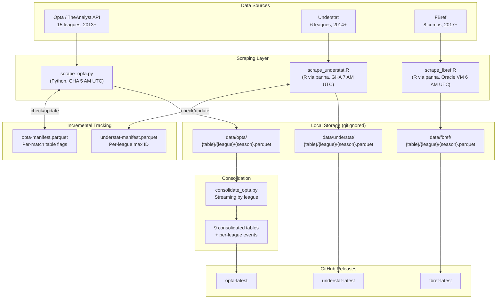

# Pannadata Scraping Architecture

How the data scraping pipelines work, how data is stored and published, and how
the scrapers connect to the rest of pannaverse.

For system-level architecture see [`../ARCHITECTURE.md`](../ARCHITECTURE.md).
For column definitions see [`DATA_DICTIONARY.md`](DATA_DICTIONARY.md).
For blog data specifics see [`BLOG_DATA_SETUP.md`](BLOG_DATA_SETUP.md).

## Overview

Pannadata scrapes football match data from three sources, consolidates it into
parquet files, and publishes to GitHub Releases. The panna R package then
downloads this data via `pb_download_source()` for its rating and prediction
pipelines.

## Architecture Diagram



## Data Sources

### Opta (Primary Source)

- **Language**: Python (`scripts/opta/`)
- **API**: TheAnalyst (theanalyst.com)
- **Schedule**: GitHub Actions daily at 5 AM UTC
- **Coverage**: 15 leagues from 2013+ (Big 5, Eredivisie, Primeira Liga, Super Lig, Championship, Scottish Prem, UCL, UEL, UECL, World Cup, Euros)

**Data types per league/season:**

| Table | Rows/season | Content |
|-------|-------------|---------|
| `player_stats` | ~500 | 280+ columns per player-match |
| `shots` | ~200 | Aggregated shot data per player |
| `shot_events` | ~3000 | Individual shots with x/y coordinates |
| `events` | ~500 | Goals, cards, substitutions |
| `match_events` | ~50,000 | All events with coordinates (SPADL-ready) |
| `lineups` | ~500 | Starting XI, subs, minutes |
| `fixtures` | ~380 | Match fixtures and results |
| `xmetrics` | ~500 | xG, xA metrics per player-match |

**Key scripts:**

| File | Purpose |
|------|---------|
| `scrape_opta.py` | Entry point. Manifest-based incremental scraping. Paginates by 2-month date ranges. |
| `opta_scraper.py` | `OptaScraper` class — API auth, pagination, data extraction. 1s rate limit. |
| `consolidate_opta.py` | Streaming league-by-league consolidation (bounded memory). Schema conflict resolution. |
| `competition_metadata.py` | League tiers (1-5) and aliases for `--tier` CLI filter. |
| `seasons.json` | Cache of Opta season UUIDs mapped from league codes. |

### Understat

- **Language**: R (via panna package functions)
- **Schedule**: GitHub Actions daily at 7 AM UTC
- **Coverage**: 6 leagues from 2014+ (ENG, ESP, GER, ITA, FRA, RUS)
- **Metrics**: xG, xGChain, xGBuildup, shot-level coordinates

**Key detail**: Understat IDs are interleaved across leagues (not sequential per league), so the scraper tracks per-league max IDs in the manifest for efficient incremental updates.

### FBref

- **Language**: R (via panna package functions)
- **Schedule**: Oracle Cloud VM cron at 6 AM UTC (FBref blocks GitHub Actions IPs)
- **Coverage**: 8 competitions from 2017+ (Big 5, UCL, UEL, cups)
- **Rate limit**: 4s between requests

## Key Patterns

### Manifest-Based Incremental Updates

All scrapers avoid re-downloading already-scraped data:

1. Download manifest from GitHub Releases at workflow start
2. Check manifest during scraping to skip known matches
3. Update manifest with new results
4. Re-upload manifest with consolidated data

**Opta manifest** tracks per-match flags: `has_player_stats`, `has_shots`, `has_match_events`, `has_lineups`, `event_unavailable`. A match is only skipped if all required data types are present.

**Understat manifest** tracks per-league max ID. Uses `--lookback N` and `--max-misses` params to control scan range.

Both maintain `.parquet.backup` files for corruption recovery.

### Streaming Consolidation (Opta)

`consolidate_opta.py` merges per-season files into consolidated tables while bounding memory:

1. Split existing consolidated file into per-league temp files (PyArrow batch reader)
2. Process one league at a time: read new per-season files, deduplicate, write via `ParquetWriter`
3. Peak memory = one league's data, not the entire dataset

**match_events** are stored per-league (`events_consolidated/events_{league}.parquet`) because they're too large (~50k rows/league/season) for a single consolidated file.

Schema conflicts across seasons are resolved by promoting types (int to float) or falling back to string.

## Local Data Layout

```
data/                                        (gitignored)
├── opta/
│   ├── {table_type}/{league}/{season}.parquet     Per-season raw files
│   ├── opta_{table_type}.parquet                  9 consolidated tables
│   ├── events_consolidated/events_{league}.parquet  Per-league (too large to merge)
│   ├── opta-manifest.parquet                      Incremental scrape tracker
│   └── opta-manifest.parquet.backup               Corruption recovery
├── understat/
│   ├── {table_type}/{league}/{season}.parquet
│   └── understat-manifest.parquet
└── fbref/
    ├── {table_type}/{league}/{season}/{match_id}.rds
    └── {table_type}/{league}/{season}.parquet
```

## Blog Data Builder

`build-blog-data.yml` runs after predictions complete. Downloads ratings and prediction outputs, enriches them, and uploads to Cloudflare R2.

**Processing steps** (each runs as a separate R script):

1. `build_blog_data.R` — Ratings parquet from seasonal xRAPM + SPM
2. `build_player_meta.R` — Player metadata (team, position) from lineups
3. `build_shot_data.R` — Shots parquet from shot_events (optional xG enrichment)
4. `rebuild_match_stats.R` — Match stats per league (one at a time, Arrow lazy eval)
5. `build_chains_ci.R` — Chain parquets per league (one at a time to avoid OOM)

**Memory strategy**: Lazy downloads (fetch files on demand), per-league processing to stay within GHA runner limits.

**Output destination**: Cloudflare R2 bucket `inthegame-data/football/` via wrangler CLI.

## Rate Limits

| Source | Delay | Notes |
|--------|-------|-------|
| Opta | 1s between requests | Paginated by 2-month date ranges |
| Understat | 3s between requests | Smart ID scanning |
| FBref | 4s between requests | Must run from non-GitHub-Actions IP |

## Connection to panna

Pannadata's primary output is GitHub Releases consumed by the panna R package:

```r
panna::pb_download_source("opta")      # Download from opta-latest release
panna::pb_download_source("understat") # Download from understat-latest release
panna::pb_download_source("fbref")     # Download from fbref-latest release
panna::pb_download_source("all")       # Download everything
```

The Understat and FBref scrapers install panna from `peteowen1/panna@dev` (not main), so dev-breaking changes can affect production scraping.

Cross-repo dispatch events chain workflows automatically (see [`../ARCHITECTURE.md`](../ARCHITECTURE.md) for the full trigger map).
